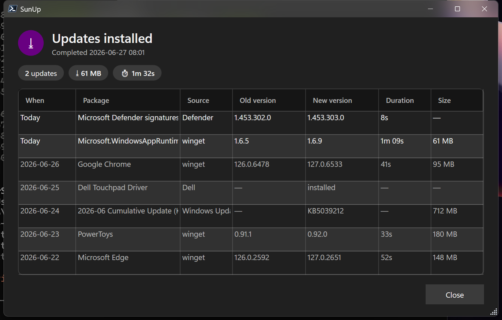
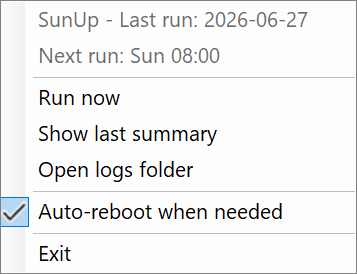

# SunUp

**Your Windows box, updated by the time you sit down.** SunUp is a self-contained, unattended
update routine for Windows — one scheduled run each morning that patches *everything safe to patch*
and shows you a clean summary of what changed. It exists because Windows Update's built-in scheduling
is unreliable: it drifts, defers, and reboots on its own clock instead of yours.

The name: it runs at **dawn (~08:00)** so you start the day with fresh updates — and it keeps the
*"up"* of Update. (Renamed from `AutoUpdate` in v0.5.0.)



The dialog shows the current run in full color and the **past 30 days** of updates greyed out beneath
it, so you can see at a glance what's been changing.

## What it updates

All toggleable in `config.json`, run in one coordinated pass:

| Component | What | Notes |
|---|---|---|
| **Defender** | Antivirus signature definitions | Duration captured per run |
| **Windows + Microsoft Update** | OS + Office/other MS products | via PSWindowsUpdate; can exclude by title (e.g. pinned `NVIDIA` drivers) |
| **winget** | Desktop app upgrades | per-package, capturing old→new version, duration, and download size |
| **Dell Command Update** | Drivers & firmware | **BIOS is reported only, never auto-flashed** |
| **PowerShell modules** | PSGallery modules | weekly (`psModules.everyDays`), not daily |

`pip` / `npm` stubs are present but off by default.

## How it's scheduled

One SYSTEM scheduled task (`SunUp`) with three triggers, de-duplicated to **once per calendar day**
by a `lastrun.json` stamp (whichever fires first does the work; the rest no-op):

- **Daily 08:00** — only if the box is awake (the trigger never wakes it).
- **Boot + 1h** — catches a day missed while powered off.
- **Resume + 1h** — catches a day missed while asleep (Power-Troubleshooter event).

A missed 08:00 is picked up ~1h after the next boot/resume, so updates never ambush you the moment
you sit down.

## The summary dialog

After every cycle (even when nothing needed updating), an interactive task (`SunUp-Notify`) shows the
Win11-styled dialog above in your desktop session. It lists the current run's updates in normal color
and the past `notify.historyDays` (default **30**) greyed out below, with a **When** column. By default
the history is collapsed to the latest occurrence per package (`notify.historyCollapse`) so daily
Defender-signature bumps don't flood it.

### Reboots, on your terms

If — and only if — an update leaves a reboot **pending**, the dialog owns a cancellable countdown
(**Restart now** / **Postpone**). A reboot that isn't actually needed never prompts you. If no one is
logged in, the engine reboots headlessly after a grace period and shows the summary at next sign-in.

The default `rebootPolicy: "ifRequired"` reboots only when a component **this run** actually reported
a reboot as required — a stray OS "pending" flag (e.g. a PnP/audio driver) no longer forces a restart.
Set `"always"` to reboot on any pending flag (the old behavior), or `"never"` to never auto-reboot.

## System tray

Windows has no service-manager UI for a scheduled task, so SunUp adds a **tray presence** — a sun
icon (amber when a reboot is pending) launched at logon. Right-click for:



- **Run now** — trigger an update pass immediately
- **Show last summary** — re-open the most recent dialog
- **Open logs folder**
- **Auto-reboot when needed** — toggle `rebootPolicy` (checkmark reflects current state)
- **Exit**

The tooltip shows the last run and reboot-pending state; a balloon pops when a run completes.

## Logging

Three tiers, so failures are trivial to find, under `C:\ProgramData\SunUp\`:

- `logs\sunup.log` — curated rolling timeline (rotated at 5 MB × 5).
- `logs\history.jsonl` — one compact JSON line per run (queryable trail; also the source for the
  dialog's 30-day history).
- `logs\runs\<timestamp>\` — isolated per-run dir (kept for the last `keepRuns`, default 30) holding
  `run.log`, a full `transcript.log`, the **raw output of every tool** in its own file, and a
  structured `result.json`.

A run that is killed mid-flight never writes `result.json`, and every other alert path runs after the
updates — so the **next** run detects the orphaned dir, reports it once (event 2011 + a SysSentry
alert naming the last line it logged) and marks it with `incomplete.json`. A run still in progress
looks the same from outside, so each run drops a `running.json` liveness marker (PID + process start
time) while it works: a concurrent manual `-Force` run is recognised as alive and left alone.

Plus a `REPORT.md` digest and the Application event log (source `SunUp`: 2000 start, 2001 clean,
2005 reboot, 2006 stale-reboot-pending, 2010 errors, 2011 previous run killed mid-run).

## Install / uninstall

```powershell
# from an elevated PowerShell, in the repo dir:
pwsh -File .\Install.ps1      # deploys to C:\ProgramData\SunUp, registers the tasks
pwsh -File .\Uninstall.ps1    # removes the tasks (add -Purge to also delete data + event source)
```

`Install.ps1` is idempotent and also **migrates a previous `AutoUpdate` install** in place (moves its
data/logs/history/config to the SunUp name, swaps the tasks and event source) without losing history.

## Manage / diagnose

```powershell
pwsh -File C:\ProgramData\SunUp\bin\Status.ps1               # task state, last run, per-component status
pwsh -File C:\ProgramData\SunUp\bin\SunUp.ps1 -Mode Errors   # last failed runs + error text + log tails
pwsh -File C:\ProgramData\SunUp\bin\SunUp.ps1 -Mode Tail     # tail of the most recent run
pwsh -File C:\ProgramData\SunUp\bin\SunUp.ps1 -Mode Run -Force   # run now, bypassing the day stamp
```

> Heads-up: a forced run **will reboot** if an update this run installs requires it (`rebootPolicy`
> `ifRequired`, the default), or if any reboot is pending under `rebootPolicy: "always"`. To test
> safely, set `rebootPolicy: "never"` first.

## Configuration

`C:\ProgramData\SunUp\config.json` (reloaded each run; keys missing from an older file are merged from
defaults):

| Key | Default | Meaning |
|---|---|---|
| `rebootPolicy` | `"ifRequired"` | `ifRequired` reboots only when a component this run required it; `always` reboots on any OS pending flag; `never` never does |
| `rebootDelaySeconds` | `120` | headless restart grace |
| `rebootGraceInteractiveSec` | `300` | countdown the dialog shows when a user is logged in |
| `pendingRebootAlertDays` | `3` | under `ifRequired`, alert once if a reboot stays pending this many days without a run requiring it (`0` disables) |
| `keepRuns` | `30` | per-run log dirs to retain |
| `notify.historyDays` | `30` | days of past updates shown (greyed) in the dialog |
| `notify.historyCollapse` | `true` | keep only the latest occurrence per package in the history |
| `notify.historyMaxRows` | `500` | cap on history rows |
| `windowsUpdate.notTitle` | `"NVIDIA"` | skip updates whose title matches (preserves pinned drivers) |
| `winget.excludePattern` | (regex) | skip pinned/self-updating/per-user apps |
| `winget.selfHostPattern` | `Microsoft\.PowerShell\|Microsoft\.DesktopAppInstaller` | packages that host the engine's own process: upgraded last, with Restart Manager disabled |
| `winget.selfHostInstallerArgs` | `MSIRESTARTMANAGERCONTROL=Disable REBOOT=ReallySuppress` | extra installer args (via `--custom`) for those packages, so the MSI can't terminate SunUp mid-run — attached only when the package publishes an `msi`/`wix`/`burn` installer, and retried without them if the upgrade rejects them |
| `psModules.everyDays` | `7` | run PowerShell-module updates at most this often |
| `dell.applyTypes` / `dell.reportTypes` | `driver,firmware,utility` / `bios` | what Dell applies vs only reports |

## Requirements

- Windows 10/11, PowerShell 7 (`pwsh`).
- [PSWindowsUpdate](https://www.powershellgallery.com/packages/PSWindowsUpdate) (installed by `Install.ps1`).
- Optional: Dell Command Update (`dcu-cli`) for hardware updates — skipped cleanly if absent.

## License

MIT
